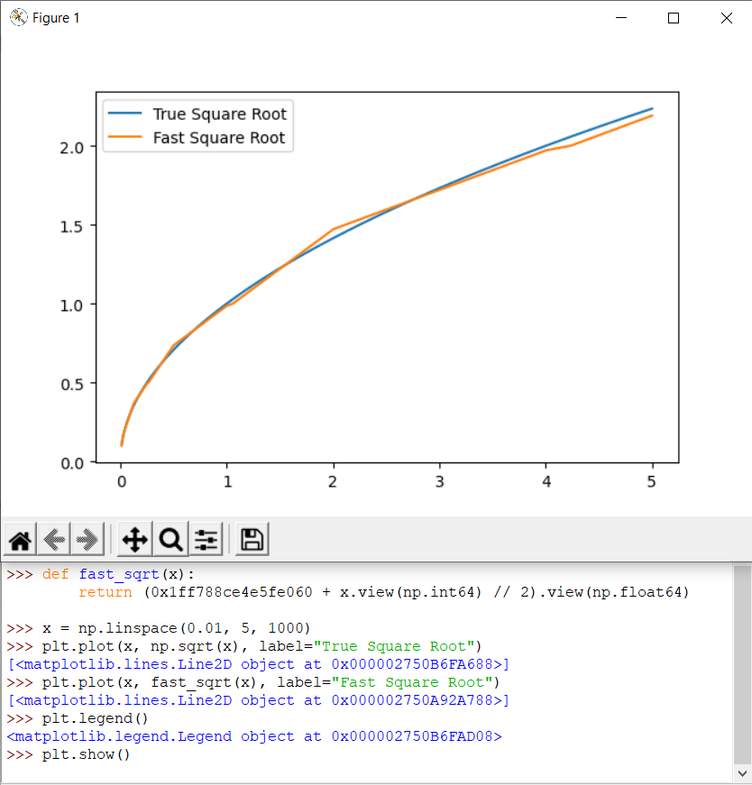

Hey, it's me again \[Double J\] programjames, here for some week two updates. The sprint tournament went pretty poorly—our seed pitted us against a T20 team in our second match, which we lost quickly and brutally. Our main issue was the soldier micro. Other teams had focused on rushing, and hence spent a lot of effort making their soldiers tip-top. Our soldiers sometimes forgot to fire when they saw an enemy.

So most of our effort went into better fighting. We tried a few different things:
1. Encircling enemies.
2. Boid'ing. Move together in a flock so launchers wouldn't wander off and get killed.
3. Have HQ's direct attacks.
4. Just run away! I requested several scrims against top players, and when they saw our robots they would just... run away.

**Encircling Enemies:** Calculate the center of mass of the enemies, then move in a direction perpendicular to it. Or one at 135º to make sure you don't inadvertently run into enemies to the side.

Success? Nope. Robots strung apart stay strung apart, which turns 3v3's into 3v1+1+1's. Even making them circle in the direction closer to friends doesn't fix the problem (robots could be out of view to the side).

**Boid'ing:** Accelerate towards friends. If a robot is consistently two units behind you, after a few turns you'll be forced to stop or turn around. However, in practice, there is no "slow down". You can either make a move or not make a move, so if you accelerate too little nothing happens, and too much will make robots reach escape velocity and fly off to the edge of the map.

Success? A little. They could flock together, but to prevent them flying off acceleration actually has to be zero (or negative) when robots are neighboring. This creates a little space between robots, a deadly weakness. Did it beat naiive encircling? Sure. But still losing to the ~100th ranked teams.

**HQ's Direct Attacks:** We have lots of information on where enemies, islands, and wells are, but each robot kind of does its own thing. What if HQ's created tasks for their subordinates to follow, like "go attack this square at this turn?" This has the bonus effect that we could get robots to all converge on the same turn, instead of attacking the enemy one-by-one.

Success? Absolutely. It won every attack the HQ's initiated. However... when all the robots are slowly converging on one location, other locations become undefended. We wouldn't lose fights, but all our carriers would get massacred while we were busy dealing with the two enemies over in the corner.

**Just... Run Away?** If you see an enemy, run away from it, preferably towards your friends.

Success? The best. Even if they don't enter fights together, they reshape themselves and become one through the struggle.

What did we learn? Fighting on the battlefield is kind of like a romance. You don't want to trap the other guy, or outmaneuver them, you should just K.I.S.S., as in keep it simple stupid. The HQ task thing is actually not so bad an idea—we'll probably adapt it to take over enemy islands/wells at the end of games—but the other "clever" movement ideas just weren't so clever.

The other (non)-micro changes we made to win fights was being mana greedy, and sending excess carriers into the fray. Many teams target the weakest unit, so having carriers soak up damage gives our launchers extra turns to hit the enemy. Also, adamantium really isn't as useful as mana, so our mining carriers should focus on grabbing that if they don't want to be sent to the front lines.

We only had a couple days to climb the elo ladder, but we shot up to 35th place. It helped that we were one of the only teams auto-accepting ranked games, so a bunch of teams played against us.

-----

### Weekly Dose of Bytecode
I spent maybe an hour on this line:
```
double magnitude = Double.longBitsToDouble(0x1ff788ce4e5fe060l + Double.doubleToRawLongBits(velX*velX + velY*velY) / 2);
```
which does the same thing as the famous `fastInverseSqrt` from Doom, just for a `double` instead of a `float` and a `sqrt` instead of an `inverseSqrt`.


Then my teammate told me `Math.sqrt` was adjusted to only cost one bytecode... and that line disappeared forever from our repo. In case you're wondering how to arrive at that magic constant, you take two steps:
1. Find the general formula. The first several bits of a double are exponent bits, meaning a right shift by one is equivalent to a square root. That's where the divide by two comes from. You can generalize this to any exponent, e.g. multiply by `e` to raise your number to the `e`th power.
2. Find the magic shift constant. Start with the shift to make `fastSqrt(1) = 1`, then binary search around there for a better constant. In my case that initial constant was `0x1ff8000000000000`, but I wanted the most accurate value for any double between 0.01 and 5 which yielded `0x1ff788ce4e5fe060`.
